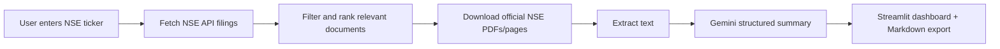

# Stock Filing Analyst Pro

A Streamlit research dashboard that turns official NSE corporate filings into a structured stock-analysis brief using Gemini.

Type an NSE ticker, fetch recent official exchange filings, review the original documents, and generate an analyst-style summary with source mapping.


## Contents

- [What It Does](#what-it-does)
- [How It Works](#how-it-works)
- [Quick Start](#quick-start)
- [Configuration](#configuration)
- [Using The App](#using-the-app)
- [Project Structure](#project-structure)
- [Deploy On Render](#deploy-on-render)
- [Docker](#docker)
- [Troubleshooting](#troubleshooting)
- [Security Notes](#security-notes)

## What It Does

| Feature | Description |
| --- | --- |
| Official filings only | Uses NSE and NSE archive links, not company investor-relations pages. |
| Recent document discovery | Looks back over the configured recent filing window. |
| Filing categories | Highlights financial results, investor presentations, transcripts, business updates, and corporate actions. |
| Source-first workflow | Shows original download links before the AI summary. |
| Gemini summary | Produces a structured research note with positives, risks, watchlist items, and source mapping. |
| Export | Downloads the final summary as Markdown. |

## How It Works



The app uses official NSE JSON endpoints for discovery and official NSE archive URLs for document extraction.

## Quick Start

1. Clone the repository.

```bash
git clone https://github.com/Vipeen21/stock-fundamental-analyst.git
cd stock-fundamental-analyst
```

2. Install dependencies.

```bash
python3 -m pip install -r requirements.txt
```

3. Create a local `.env` file.

```bash
GEMINI_API_KEY="your_gemini_api_key"
GEMINI_MODEL=gemini-3-flash-preview
```

4. Run the app.

```bash
streamlit run app.py
```

Then open:

```text
http://localhost:8501
```

## Configuration

| Variable | Required | Default | Purpose |
| --- | --- | --- | --- |
| `GEMINI_API_KEY` | Yes | None | API key for Gemini summary generation. |
| `GEMINI_MODEL` | No | `gemini-3-flash-preview` | Gemini model used for structured output. |

Important app constants live in `src/config.py`.

| Setting | Current Value | Purpose |
| --- | --- | --- |
| `LOOKBACK_DAYS` | `120` | Recent filing window. |
| `MAX_DOCUMENTS_FOR_SUMMARY` | `8` | Number of top documents sent to Gemini. |
| `MAX_PDF_PAGES` | `25` | PDF extraction limit per document. |
| `MAX_CHARS_PER_DOCUMENT` | `14000` | Text cap per document. |

## Using The App

1. Enter an NSE ticker such as `SBIN`, `RELIANCE`, or `TCS`.
2. Click **Build report**.
3. Review the charts and original NSE download links.
4. Open the **Summary** tab for the Gemini-generated analysis.
5. Download the final Markdown summary if needed.

The summary is designed to stay grounded in supplied NSE documents. If the filings do not contain a number or fact, the model is instructed not to invent it.

## Project Structure

```text
stock-fundamental-analyst/
├── app.py                  # Streamlit entry point
├── requirements.txt        # Python dependencies
├── render.yaml             # Render deployment config
├── Dockerfile              # Container build
├── docs/
│   └── EXPLANATION.md      # Plain-English code guide
└── src/
    ├── config.py           # Constants and NSE URLs
    ├── models.py           # Pydantic data models
    ├── nse_client.py       # NSE fetching and document extraction
    ├── summarizer.py       # Gemini structured summary
    └── ui.py               # Charts, tables, and summary UI
```

## Deploy On Render

This repository includes `render.yaml`.

1. Create a new Render Blueprint or Web Service from this GitHub repo.
2. Set the secret environment variable:

```text
GEMINI_API_KEY=your_gemini_api_key
```

3. Keep or override:

```text
GEMINI_MODEL=gemini-3-flash-preview
```

4. Render will use:

```bash
pip install -r requirements.txt
streamlit run app.py --server.address 0.0.0.0 --server.port 10000
```

## Docker

Build:

```bash
docker build -t stock-filing-analyst-pro .
```

Run:

```bash
docker run -p 8501:8501 --env-file .env stock-filing-analyst-pro
```

## Troubleshooting

<details>
<summary>Gemini summary is not generated</summary>

Check that `.env` exists locally and contains a valid key:

```bash
GEMINI_API_KEY="your_gemini_api_key"
GEMINI_MODEL=gemini-3-flash-preview
```

Also confirm that the model name is available for your Gemini API account. If `gemini-3-flash-preview` is unavailable in your region/account, try a supported Gemini model and update `GEMINI_MODEL`.

</details>

<details>
<summary>No documents are found for a ticker</summary>

Try a large, actively listed NSE symbol such as `SBIN` or `RELIANCE` first. Some tickers may have no recent filings matching the app's keywords during the current look-back window.

</details>

<details>
<summary>NSE requests fail or time out</summary>

NSE can occasionally reject or throttle automated traffic. Retry after a short wait, or deploy from a network that can access `nseindia.com` and `nsearchives.nseindia.com`.

</details>

<details>
<summary>PDF text looks incomplete</summary>

Some exchange PDFs are scanned images or contain unusual encodings. The app extracts text from PDFs, but OCR is not currently included.

</details>

## Security Notes

- Do not commit `.env`.
- Keep `GEMINI_API_KEY` in local environment variables or deployment secrets.
- `.gitignore` excludes local secrets, Python caches, and OS metadata.
- The app displays source URLs so every generated takeaway can be checked against original filings.
